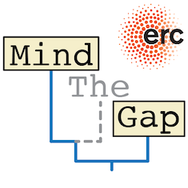

{fig-alt="MindTheGap project logo"}

Welcome to the webpage of the project.

We develop numerical models to study the structure of the geological record and make better recontructions of past evolutionary dynamics. Our goal is to understand how time, environmental and evolutionary events are represented in imperfect, gappy records and to use this knowledge to reconstruct the history of life and palaeoclimate.

This project is a consortium between [Utrecht University](https://www.uu.nl/en/research/department-of-earth-sciences) and [the Netherlands eScience Center](https://www.esciencecenter.nl/). Some software used and developed in this project is a continuation of [AstroTOM](https://github.com/astro-turing). See also project record at [CORDIS](https://cordis.europa.eu/project/id/101041077).

### Project news

- Upcoming workshop: [**Bridging Stratigraphic Palaeobiology and Phylogenetics**](https://www.lorentzcenter.nl/bridging-stratigraphic-palaeobiology-and-phylogenetics.html) co-organized by Emilia Jarochowska, Rachel Warnock, Niklas Hohmann, Johan Hidding and Laura Mulvey, will take place at the Lorentz Center in Leiden on 28 September - 2 October 2026

- **New paper** [CarboKitten.jl – an open source toolkit for carbonate stratigraphic modeling](https://gmd.copernicus.org/articles/19/6207/2026/) with a [code companion website](https://mindthegap-erc.github.io/CarboKitten-research-paper/)

-   **New preprint:** *Stratigraphic Paleobiology of Carbonate Systems*, DOI: [10.64898/2026.06.12.732006](https://doi.org/10.64898/2026.06.12.732006) led by Niklas Hohmann

-   **New preprint:** *Stratigraphy as a low-pass filter: selective preservation of spatial variability on a Holocene carbonate platform*, DOI: [10.31223/X5K784](https://doi.org/10.31223/X5K784) led by Xianyi Liu

*Funded by the European Union (ERC, MindTheGap, StG project no 101041077). Views and opinions expressed are however those of the author(s) only and do not necessarily reflect those of the European Union or the European Research Council. Neither the European Union nor the granting authority can be held responsible for them.*
