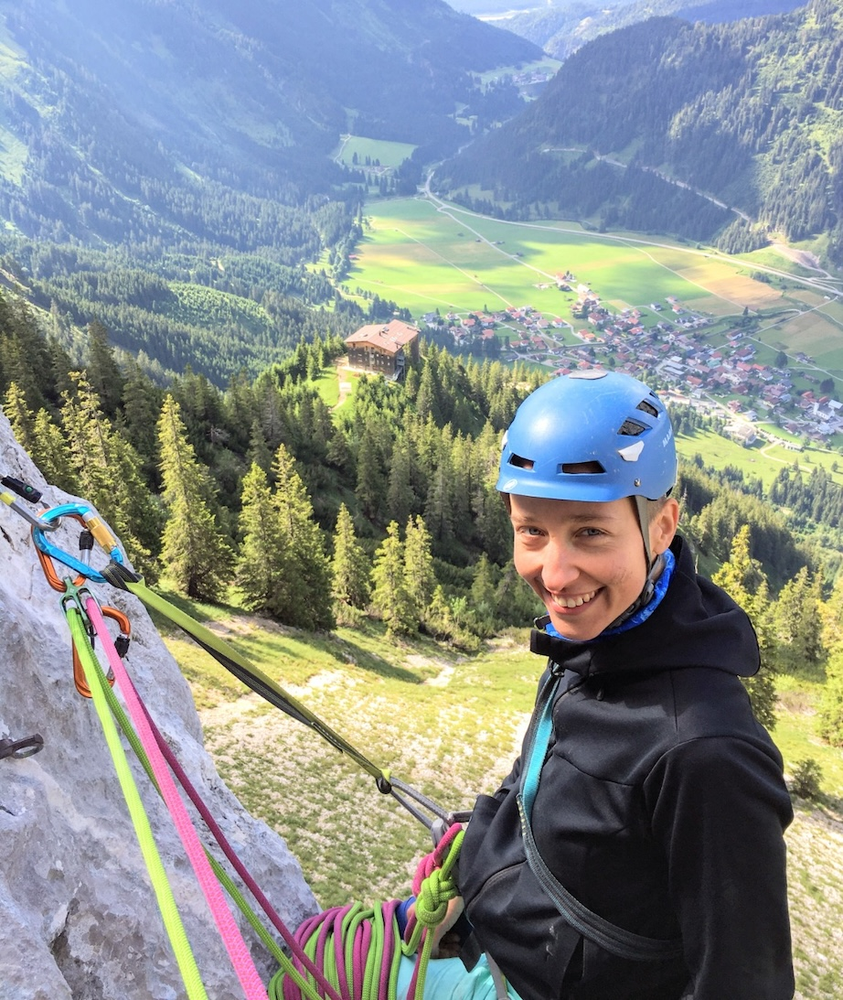
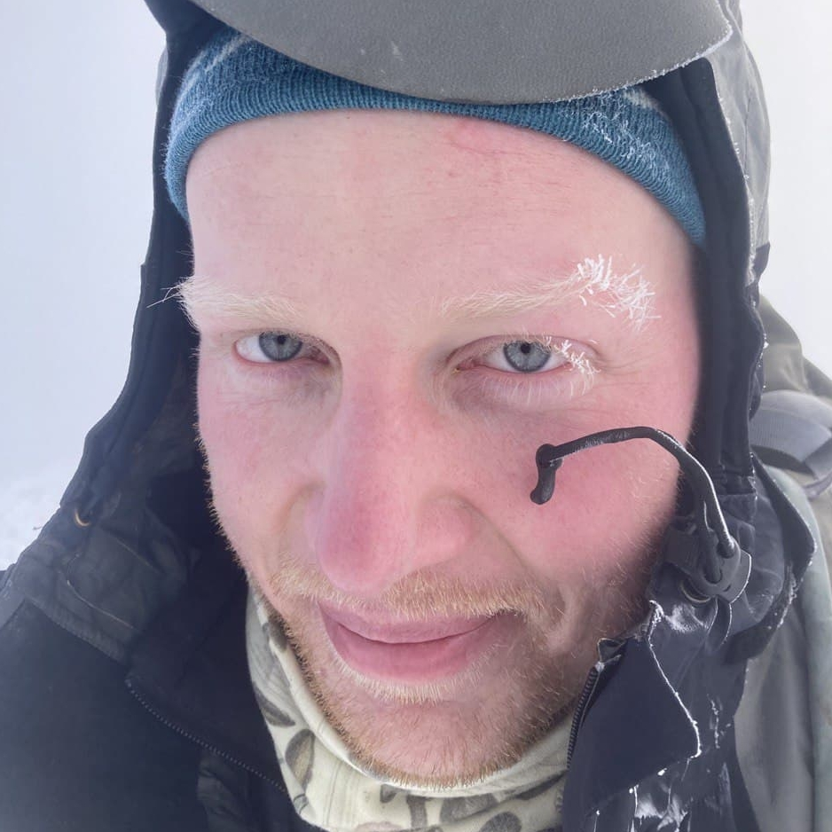
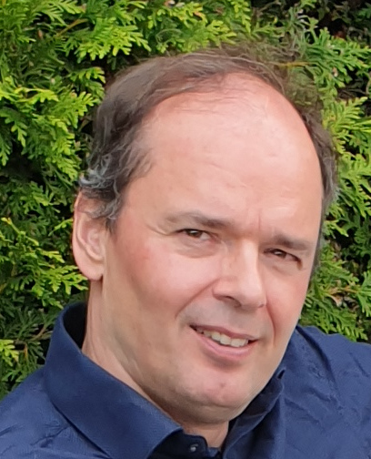

{fig-align="left" width="200"}

**Emilia Jarochowska**\
Principal Investigator\
Utrecht University\
email: e.b.jarochowska \[at\] uu.nl\
Web page: [www.uu.nl/staff/EBJarochowska](https://www.uu.nl/staff/EBJarochowska)\
ORCID: [0000-0001-8937-9405](https://orcid.org/0000-0001-8937-9405)

**Xianyi Liu**\
Postdoctoral researcher\
Utrecht University\
email: x.liu6 \[at\] uu.nl\
Web page: [www.uu.nl/staff/XLiu6](https://www.uu.nl/staff/XLiu6)\
ORCID: [0000-0002-3851-116X](https://orcid.org/0000-0002-3851-116X)

{fig-align="left" width="200"}

**Niklas Hohmann**\
PhD student\
Utrecht University\
email: n.h.hohmann \[at\] uu.nl\
Web page: [www.uu.nl/staff/NHohmann](https://www.uu.nl/staff/NHHohmann)\
ORCID: [0000-0003-1559-1838](https://orcid.org/0000-0003-1559-1838)

{fig-align="left" width="200"}

**Hanno Spreeuw**\
Research Software Engineer\
Netherlands eScience Center\
email: h.spreeuw \[at\] esciencecenter.nl\
Web page: [www.esciencecenter.nl/team/dr-hanno-spreeuw/](https://www.esciencecenter.nl/team/dr-hanno-spreeuw)\
ORCID: [0000-0002-5057-0322](https://orcid.org/0000-0002-5057-0322)

**Johan Hidding**\
Research Software Engineer\
Netherlands eScience Center\
email: j.hidding \[at\] esciencecenter.nl\
Web page: [www.esciencecenter.nl/team/johan-hidding-msc/](https://www.esciencecenter.nl/team/johan-hidding-msc/)

{fig-alt="Dr Charlotte Summers" fig-align="left" width="200"}

**Charlotte Summers**\
Research Software Engineer\
Utrecht University\
email: c.summers \[at\] uu.nl\
Web page: [www.uu.nl/staff/CSummers](https://www.uu.nl/staff/CSummers)

## Collaborators

+------------------------------------------------------------------------------------------------------------------------------------------------------+----------------------------------------------------------------------------------------------------------------------------------------------------------------------------------------+---------------------------------------------------------------------------------------+
| **Peter Burgess**\                                                                                                                                   | **David De Vleeschouwer**\                                                                                                                                                             | **Rachel Warnock**\                                                                   |
| Collaborator\                                                                                                                                        | Collaborator\                                                                                                                                                                          | Collaborator\                                                                         |
| University of Liverpool\                                                                                                                             | Westfälische Wilhelms-Universität Münster\                                                                                                                                             | Friedrich-Alexander-Universität Erlangen-Nürnberg\                                    |
| Web page: [www.liverpool.ac.uk/environmental-sciences/staff/peter-burgess](https://www.liverpool.ac.uk/environmental-sciences/staff/peter-burgess/)\ | Web page: [www.uni-muenster.de/GeoPalaeontologie/erdsystemforschung/staff/DeVleeschouwer](https://www.uni-muenster.de/GeoPalaeontologie/erdsystemforschung/staff/DeVleeschouwer.html)\ | Web page: <https://www.gzn.nat.fau.de/palaeontologie/team/professors/rachel-warnock/> |
| ORCID: [0000-0002-3812-4231](https://orcid.org/0000-0002-3812-4231)                                                                                  | ORCID: [0000-0002-3323-807X](https://orcid.org/0000-0002-3323-807X)                                                                                                                    |                                                                                       |
+------------------------------------------------------------------------------------------------------------------------------------------------------+----------------------------------------------------------------------------------------------------------------------------------------------------------------------------------------+---------------------------------------------------------------------------------------+

## Students

### Current

Myrthe van der Heide, MSc thesis "Jurassic and Cretaceous fossil decapod ecologies based on geometric morphometrics"

### Past

**Pelle Huizinga**

BSc thesis 2026 "Edge-concentrated change and meadow consolidation: 82 years of seagrass patch dynamics on the western Caicos Bank", co-supervised by Xianyi Liu

**Kevin Deenik**

BSc thesis 2026 "How have the classes and their patch characteristics changed over the last 80 years? Assessment based on aerial and satellite imagery from the Turks and Caicos", co-supervised by Xianyi Liu

**Thodoris Tsaveas**

MSc thesis 2026 "Reconstruction of spatial and temporal changes of marine facies in the Bahamas through topological data analysis", co-supervised by Xianyi Liu

**Dennis Lutgens**

MSc thesis 2026 "Tracing the geomorphological transformation of shallow-water environments in the Bahamas: From 1940s aerial photos to modern satellite imagery", co-supervised by Xianyi Liu

{width=100}

**Bruno Peeters**

BSc thesis "The fossil falls far from the tree: how biases in the fossil record skew phylogenetic trees. A review summarizing and evaluating the obstacles/barriers to incorporating the fossil record in phylogenetic tree reconstruction" and internship "Recovering close ancestors to descendants. A report looking at the recoverability of sampled ancestors under the FBD process", co-supervised by Niklas Hohmann

**Julia Szpor**
*University College Utrecht*

BSc thesis 2026 "Extinct or Left Without Saying Goodbye? Ecological Bias in the Late Devonian Mass Extinction", co-supervised by Niklas Hohmann

{width="162"}

**Anna Jansen**

*University College Utrecht*

BSc thesis 2025, on modelling the effects of ecological niches on the record of mass extinctions, co-supervised by Niklas Hohmann

{width="200"}

**Sidney Bickerton**

Guided research 2025 "Last occurrence of species in a carbonate platform based on varying environmental conditions", co-supervised by Niklas Hohmann

**Laurent Puyana**

*University of Florida*

Internship (2025): *Historical changes in the distribution of ecological facies in the Bahamas*, co-supervised by Xianyi Liu

**Robin L.C. Pijnenburg**

BSc thesis (2023): *A high-resolution record of Devonian conodont evolution*, co-supervised by Niklas Hohmann

**Twan Megens**

BSc thesis (2023): *Evidence of microevolution of* Tripodellus gracilis *during the Famennian anoxic events in Kowala quarry in the Holy Cross mountains, Poland*, co-supervised by Niklas Hohmann
